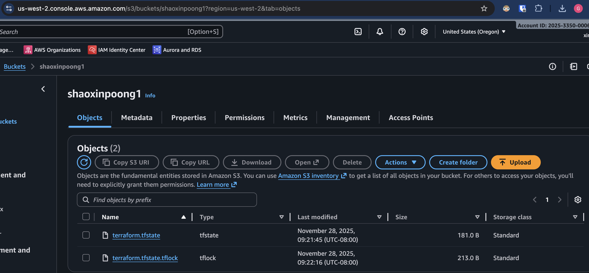
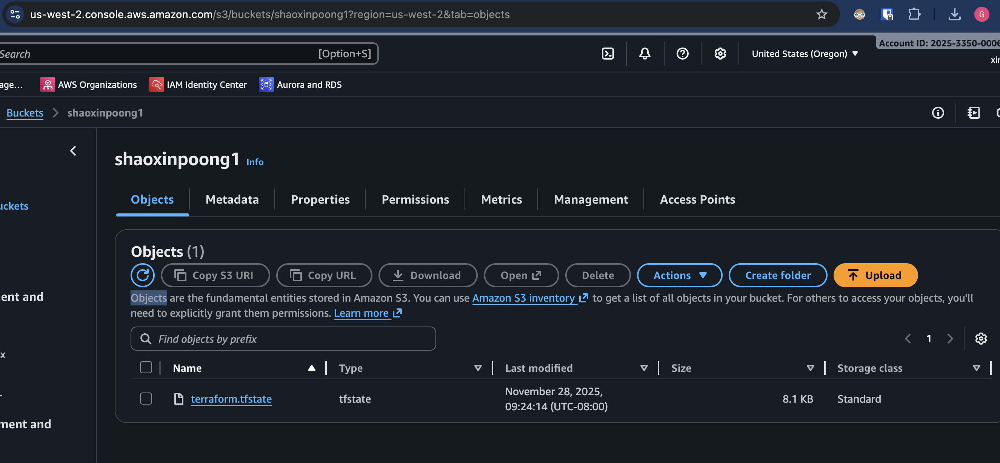

# terraform-s3-backend-lab

["Chris Poon", "John Yin", "Xinyu Gong"]

**When is the state file created?**

It is created (or updated) immediately after the resources are successfully provisioned (after the apply completes).
---

**When is the lock file present?**

It is present only while a state-modifying operation (plan, apply, destroy) is actively running.
---

**Is the lock file always in the bucket after it is created?**

No. It is deleted automatically once the Terraform process finishes (success or fail).
